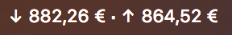

# CryptoRates

A small macOS status bar app to keep track of the USD, EUR, anything - Bitcoin exchange rate.

### Technical details
The app is written in Swift and uses the [Coinbase API](https://developers.coinbase.com) as source for the data.

##### Note

This is just a project I've worked on for personal use so, at least for now, doesn't have any settings. It just gets the desidered currecy from the users locale and displays buying and selling prices in the status bar.
